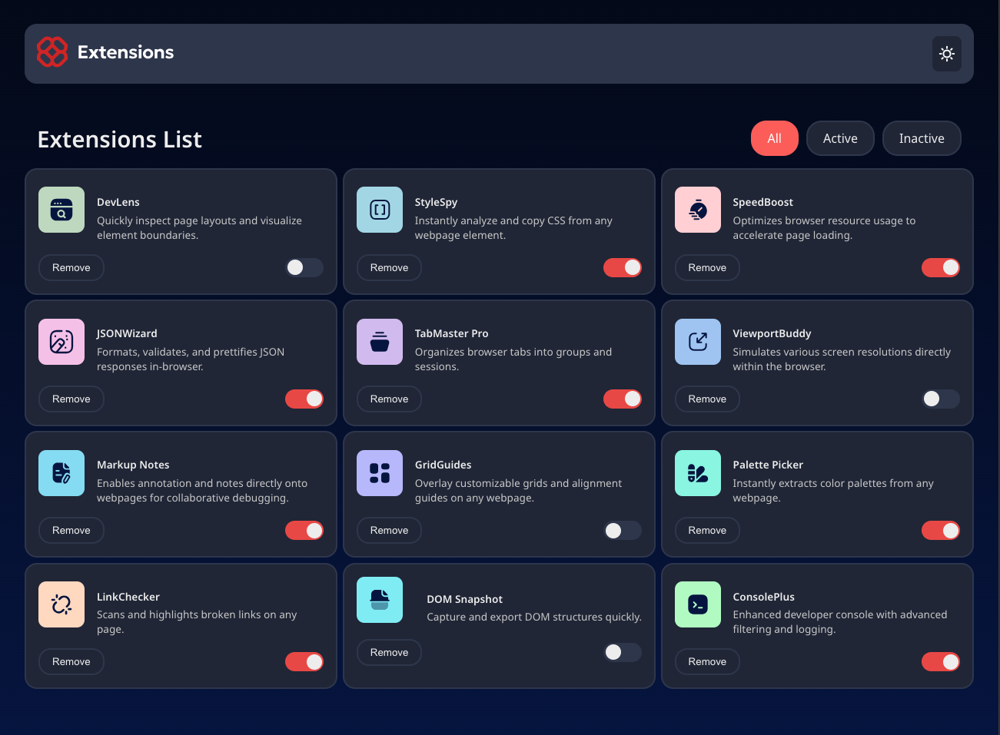

# Frontend Mentor - Browser extensions manager UI solution

This is a solution to the [Browser extensions manager UI challenge on Frontend Mentor](https://www.frontendmentor.io/challenges/browser-extension-manager-ui-yNZnOfsMAp). 

## Table of contents

- [Overview](#overview)
  - [The challenge](#the-challenge)
  - [Screenshot](#screenshot)
  - [Links](#links)
- [My process](#my-process)
  - [Built with](#built-with)
  - [What I learned](#what-i-learned)
  - [Continued development](#continued-development)
  - [Useful resources](#useful-resources)
- [Author](#author)
- [Acknowledgments](#acknowledgments)


## Overview

### The challenge

Users should be able to:

- Toggle extensions between active and inactive states
- Filter active and inactive extensions
- Remove extensions from the list
- Select their color theme
- View the optimal layout for the interface depending on their device's screen size
- See hover and focus states for all interactive elements on the page

### Screenshot




### Links

- Solution URL: [Add solution URL here](https://your-solution-url.com)
- Live Site URL: [Add live site URL here](https://your-live-site-url.com)

## My process

### Built with

- Semantic HTML5 markup
- CSS custom properties
- Flexbox
- CSS Grid
- Mobile-first workflow
- [React](https://reactjs.org/) - JS library


### What I learned


```jsx label accessibility

 <input 
    aria-hidden="true"
    type="radio" 
    id="all" 
    name="extension-status" 
    onChange={() => { showAllExtensions() }} 
    onKeyDown={(e) => { if (e.key === 'Enter' || e.code === 'Enter' || e.code === 'NumpadEnter' || e.key === ' ') showAllExtensions() }} 
    defaultChecked 
  />
  <label 
    htmlFor="all"
    role="switch" 
    tabIndex={0} 
    onKeyDown={(e) => { if (e.key === 'Enter' || e.code === 'Enter' || e.code === 'NumpadEnter' || e.key === ' ') showAllExtensions() }}
    aria-label='Show all extensions'
    //aria-checked="true"
  >
    All
  </label>

```

## Author

- Website - [Osaro](https://osaro.vercel.app)
- Frontend Mentor - [@Osaaroh](https://www.frontendmentor.io/profile/osaaroh)


